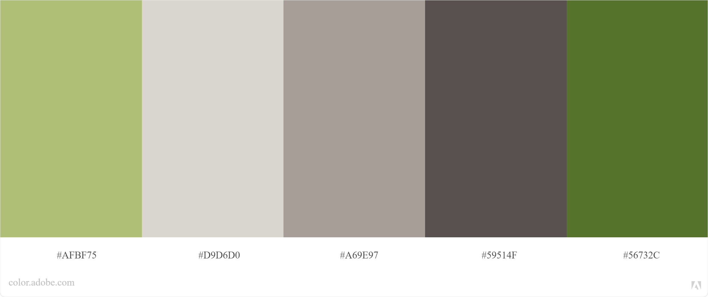

# Karolina Loniewska - städfirma


The website is deployed here: [website](https://marlene32100.github.io/karolinaloniewska/)

## Table of content

## Description

This is the website for the cleaning company "Karolina Loniewska", based in Knivsta (Sweden).

The website has a landing page as index, with a full-screen background image, and on the bottom a section with the company logo and the hamburger menu.

By clicking on the menu, the user can choose between different paths:

- Welcome area

- About the company

- Services

- Sustainability

- Contact / Booking

The **welcome area** has a background image which is fixed. On the top of that there is a caption with three adjectives ("clean, fresh, professional"), followed by the indication of the geographical area where the cleaning company works and a call-to-action button.

The button should allow users that already know the company to book immediately the service without having to scroll down the page.

At the bottom of the page, as in the landing page, there is a section with logo and hamburger menu.

After this welcome section, there is the area dedicated to the **company**.

Here, a picture of Karolina welcomes again the user explaining that she has many years of experience in cleaning and suggesting the user that he/she can feel comfortable and safe with her service.

The **service** area has a brief indication about prices and gives a selection of cleaning option through button-links.

The user can choose the service just by clicking on the button or can simply keep scrolling.

For each kind of cleaning, there is a detailed list with all the actions that are included in the service.

A call to action follows each description, allowing the user to book immediately.

After that area there is a section dedicated to **sustainability**. Here a brief description of the products used is given, pointing out that the company tries to use as much as possible detergents that are safe for the environement.

Finally, the **contact** section. After the logo, there is the address and two icons that link to the Facebook page of the company or directly to the e-mail.

---

## User Experience (UX)

- ### Strategy Plane

The website should be the business card of **Karolina Loniewska-städfirma**, which means it should give a straight visual idea of the values and goals of the cleaning company.

The most important thing that must be highlighted is the professionality, followed by the attention towards the environment.

The company has a great quality standard that makes the difference among other competitors.

This is the main key point that should lead the planning of the website.

As said before, another important thing that makes the difference is the ecological sensibility. The company uses (as much as it is possible) natural products that respect the environment. That should be immediately clear.

The goal of the website is to attract new customers and generate leads.

A final target user is a person aged 30-65 (eventually > 65) that lives in the Knivsta area and lives with his/her own family.

Usually, the average customer of this kind of service (house cleaning) has children.

What the user is looking for, is a trustable company that is able to take care of his/her private home in the best possible way.

The user needs to understand the core value of the company, the services offered, the prices and how to contact them.

Other competitors in the area have a very low-quality website, or they don't have it at all: that is a very good point in favor of the cleaning company that owns this website.

Being professional also on the web helps the user to understand in a glance the quality level that the company offers.

- ### Scope Plane

The website will include nice pictures in a minimalistic style to convey the idea of pureness and cleanliness.

The cleaning company needs a website that expresses its professionality, reliability and trustworthy. The company wants to gain new customers, but also have a presence on the web.

The website needs to be a clear showcase of the brand. To achieve this the best solution is to stick with a modern design with modern features, giving the most important information without being too redundant and verbose.

- ### Structure Plane

The website is going to have a landing page which leads to the actual website, which is structured as a single page with different sections: company, services,sustainability and contact(/booking).

A navigation bar is going to be stuck on the bottom of the page, so that the user can move anytime on a different section without scrolling. Clicking on the hamburger icon (menu) is going to open a full-screen page with the links to the different sections of the website.

Links will change style on hover, so that a user knows that he/she can click on it for more content. Call-to-action links have a button styling.

Links that lead to an external page (such as social medias) are going to open on a new tab, so the user will not lose access to **Karolina Loniewska-städfirma**.

- ### Skeleton Plane

All the sections will have the same style (same background, typography, similar percentage of space occupied by content). The design will be consistent leaving a sense of breathe, peace and quiet.

The wirerame is here: [sketch project](readme-doc/images/wireframe.png).

- ### Surface Plane

The color palette is very consistent throughout the website, and is obtained extracting the main colors from the images.

The images, as well, are going to be consistent: they will have the same minimal style with colors that reminds of natural products (such as wood, natural fabrics).

#### User Stories

- **First Time Visitor Goals**
  - As a First Time Visitor, I want to understand which kind of company it is and what it has to offer.
  - As a First Time Visitor, I want to understand what the cleaning company does for each service.
  - As a First Time Visitor, I want to check where the company is based and how to contact them.
- **Returning Visitor Goals**
  - As a Returning Visitor, I want to find out if there are new services available or new prices.
  - As a Returning Visitor, I want to contact the travel agency.
- **Frequent User Goals**
  - As a Frequent User, I want to contact immediately the travel agency without scrolling the website.

#### Design

For this project I decided to use a single page layout, playing with design. The goal of the website is to show immediately the brand image of the cleaning company. It means that the user should feel from the very first second a sense of professionality and safety. To achieve this, I used a minimal layout, but well planned in its details.

First of all, the landing page has a full-screen image showing a hotel-style bathroom. This immediately conveys the idea of luxury, high quality and perfect cleaning.

Clicking on the menu, a full-screen black opaque overlay is shown with the links to the different sections of the website.

The first area of the home page replicates the index page with a full-screen background image. This time, however, the image is much more minimal and simple, with a lot of negative space. This has a psycological effect on the user: if at first the user has been attracted by the feeling of luxury in the landing page, now the clean and minimal image brings another level of attraction, pushing the idea of "cleaning" and "pureness" in the mind of the user.

The color are natural tones, giving an immediate feeling of nature which is connected to the sustainability values of the company.

In this way, in a couple of seconds, the user has already experienced the key features of the company: professionality, cleanliness, and eco-sensibility.

That has a powerful impact. Moreover, in this first section of the home page, there is a call-to-action button that allows the user to book immediately a cleaning session.

The button, as all the buttons on the page, on hover changes color and gets tridimensional with a shadow effect.

The rest of the page is divided into thematic sections. Each section has a title, eventually a brief introduction, and then a row with an image and a text. A call-to-action is placed inside each section.

The contatc section shows the logo of the company, the address, and two big icon links.
One link leads to Facebook (to the company page), the other one directly to the email.

#### Color Palette



That simple color palette has been obtained extracting the main colors of the pictures used in the page.

While keeping the most natural shades for the backgrounds, I chose the green shade for the call to action buttons.

#### Typography

The font that I used are "Montserrat" and "Raleway". They are very modern and minimal and I think that they are perfect for a design that should remind purity and perfection. I have played with different heights and weight to add more character to the style.

#### Imagery

For this website I used some beautiful images from Pexels.

To avoid the website being too heavy to load, I used Resize Image and PicResize to crop and resize images. All the images are responsive on all devices and to obtain this, I used the picture tag as shown below:

```html
<picture>
  <source srcset="assets/images/stor-xl.jpg" media="(min-width: 1200px)" />
  <source srcset="assets/images/stor-lg.jpg" media="(min-width: 992px)" />
  <source srcset="assets/images/stor-md.jpg" media="(min-width: 768px)" />
  
</picture>
```

Logo has been provided directly from the company.

#### Wireframes

The wireframe has been made with Adobe XD. [Here](readme-doc/images/wireframe.png) the preview.

#### Features

The website has a clean layout with all the essential informations displayed both on smaller and larger screen. There is a navigation bar, a footer with all the links to connect with the cleaning company, a section about the company itself. I have checked the responsiveness on all devices so that everything looks nice and clear.

The website is also fast to navigate; people usually don't want to spend too much time on a website looking for informations. Most of the time, also, people navigate from their mobile phones when they are (for instance) travelling on a bus, train, or in other situations where they don't have too much time.

I have used JavaScript to add some extra features to the website. For instance, to create a full-screen menu, a spinning hamburger icon on hover, and to change the style of the navbar section from transparent to beige when scrolling. In this way the content is always visible and it is not mixed with the images and text content in the sections of the page:


Here the transparent navbar at the beginning of the page.


And this is how it looks when the user scrolls down the page.

#### Features to implement

A nice feature to add in the future can be a JavaScript implementation that loads the content only when scrolling, and then displays it on the page with some animation.

This will improve the loading speed and at the same time will improve the user experience.

---

### Technologies Used

- Languages Used

  - HTML5
  - CSS3
  - JavaScript

- Frameworks, Libraries & Programs Used
  - Bootstrap 4.5.0.
  - Google Fonts
  - Font Awesome 4.7.0.
  - jQuery
  - Git
  - GitHub
  - GitHub Pages
  - Visual Studio Code
  - Chrome DevTools
  - Lighthouse
  * PageSpeed Insight
  * Test Mobile Friendly
  - Techsini mockup generator
  - Autoprefixer CSS
  - Adobe XD
  - Favicon.ico

---

### Testing

- #### Functionality Testing

  All the links have been checked and they all are working.
  Html and Css have been validated with HTML Validator and CSS Validator.
  I tested Javascript while compiling using console.log to check if I was coding properly, and I also checked with JSHint.

* #### Usability Testing

  To test the usability I tried myself the website on multiple devices and using Chrome DevTools.
  The webite is easy to navigate and the typography is legible, plus it is responsive on all devices.
  All the images have the "alt" text and are responsive. I used the picture tag to allow the browser to pick up the right format of the image according to the screen size.

  The Html code has been properly written to help screen readers for visually impaired users. The contrast color between background and text in the call-to-action buttons could be a little stronger to make it more accessible, but considering the low percentage of potential users that may have visual impairment, I chose to leave a softer tone which goes better with the general styling of the website.

* #### Compatibility Testing

  I tested the website on multiple browsers:

  - Chrome
  - Edge
  - Firefox
  - Internet Explorer
  - Safari
  - Opera

  I tested also on multiple devices with Google DevTools, AmIResponsive, on iPhone 11 and extra-large desktop.

  After testing I added additional styling for iOS since it has some bugs with the "fixed" property. The property has been used to display the background image in the home page. To make it perform in the proper way also on iOS, I decided to add the background image to a pseudo-element `html ::after ` in the body:

  ```html
  body::after { content: ""; position: fixed; top: 0; height: 100vh; left: 0;
  right: 0; z-index: -1; background: url(images/blackvase-sm.jpg) bottom right;
  background-size: cover; background-repeat: no-repeat; background-color:
  #a69e97; }
  ```

* #### Performance Testing

  I tested the website with Google PageSpeed Insights and the result was very good for desktop devices, a little less for mobiles due to Bootstrap CDN.

  I tested further with Google Test Mobile Friendly and the result was really good. The website performs well on mobile phones.

  External links have `html rel="noopener noreferrer"` to improve security.

  Meta tags have been widely added to improve SEO optimization on search engines.

### Bugs

So far there are no known bugs, since the website has been widely tested and all small details have been fixed to perform well and give a very good user experience.
